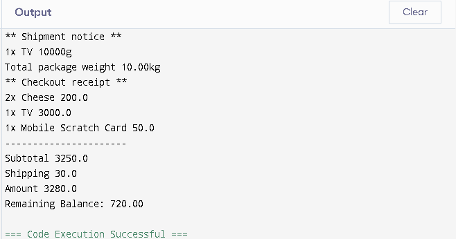

# E-Commerce Checkout System (Java)

This is a simple Java console application that simulates a basic e-commerce checkout system with support for:
- Different product types (Expirable, Non-Expirable, Shippable)
- Cart operations and validations
- Customer balance checks
- Shipping fee calculation

## Features

- Add various product types to the cart
- Check for product expiration and stock availability
- Automatically calculate shipping fees for shippable items
- Prevent checkout if:
  - Product is expired
  - Insufficient customer balance
  - Cart is empty
- Print a checkout receipt with total, shipping, and remaining balance

## How to Run

1. Clone or download the repository
2. Open `Main.java` in your Java IDE (IntelliJ IDEA or VS Code)
3. At the top of the file, set the `testCase` variable to one of the following:
   - `1`: Success (checkout works normally)
   - `2`: Insufficient balance
   - `3`: Expired product
   - `4`: Empty cart
4. Run the `main` method

## Example Output (Test Case 1 - Success)

** Shipment notice **
1x TV 10000g
Total package weight 10.00kg
** Checkout receipt **
2x Cheese 200.0
1x TV 3000.0
1x Mobile Scratch Card 50.0
Subtotal 3250.0
Shipping 30.0
Amount 3280.0
Remaining Balance: 720.00

## Screenshot

This is a real screenshot of the program output:

## Technologies Used

- Java
- OOP (Object-Oriented Programming)
- Java Collections (Map, List)

## Created by

Taghreed Basuny 

